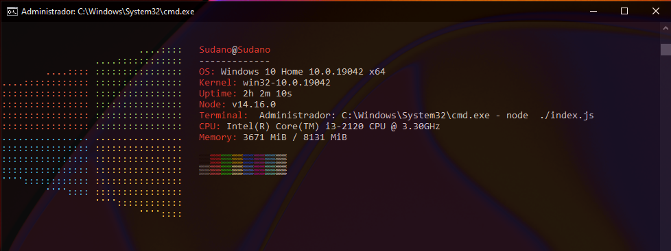

# nodefetch
🖼️ | NodeFetch é uma ferramenta de informações do sistema em command-line de código aberto escrita em nodejs (v14.16.0), baseada na aplicação neofetch para sistemas linux.

### Dependencia(s):
- chalk ^4.1.1 (colored texts)

